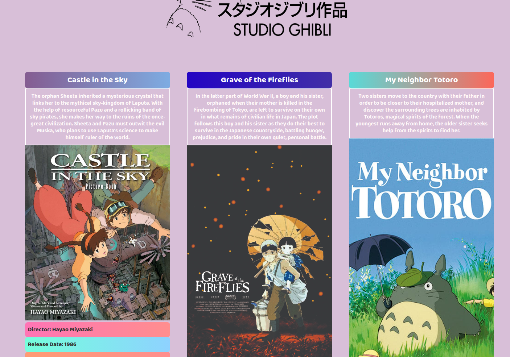

# Studio Ghibli Films
</img>

# About this project

I found this public Studio Ghibli API : https://ghibliapi.herokuapp.com/films, which returns all the movies and some related data, like rotten tomatoes score.
Unfortunately, this api doesn't have images related to the films, so i did it. You can find the modified api on my repository: https://github.com/tilucast/Studio-Ghibli-API (Node REST folder.) 

After installing the dependencies, run **yarn dev / npm run dev** to start the server, and make a request to **http://localhost:3333**.

No dependencies on this one. Since im using Alpine, all you need is on an CDN already linked on the html.

As for my experience with Alpine, it seems good enough for smaller projects. Give it a try.
